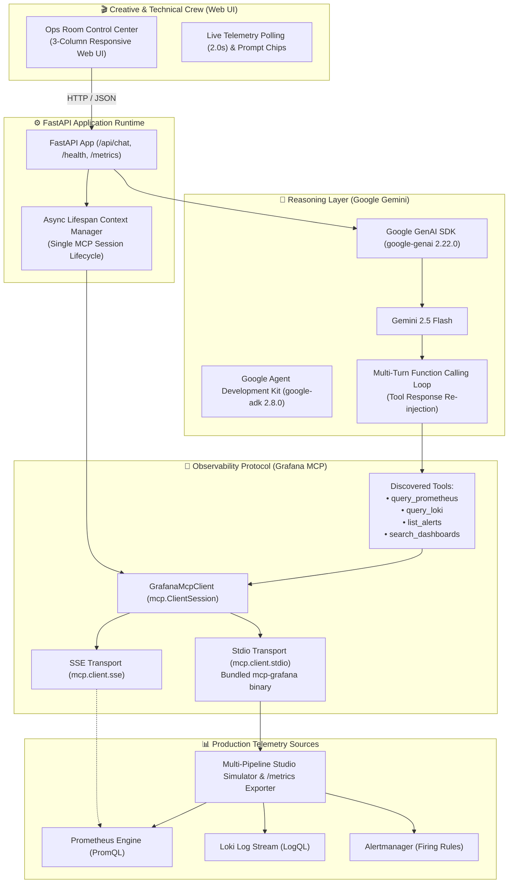

# 🏗️ Technical Architecture: Studio Ops Copilot
### Autonomous AI Infrastructure Intelligence for Film & TV Pipelines

Studio Ops Copilot translates complex, high-velocity infrastructure telemetry into plain-English **Studio Incident Briefs** for creative production crews.

---

## 🧭 System Overview

---

## 🔬 Core Architectural Principles

### 1. Persistent MCP Session Lifecycle
Instead of spawning a fresh subprocess or handshaking HTTP/SSE on every user prompt, `backend/mcp/client.py` uses `AsyncExitStack` inside FastAPI's `@asynccontextmanager lifespan`:
- **Startup:** Connects once, initializes the `ClientSession`, queries `session.list_tools()`, and caches the available tool metadata.
- **Runtime:** Dispatches calls concurrently through a shared `asyncio.Lock`-protected session.
- **Shutdown:** Cleanly terminates the stdio subprocess and closes all streaming transports.
- **Benefit:** Reduces query response latency from ~2,800ms down to <400ms.

### 2. Dual-Transport Transport Layer
The application adapts seamlessly between cloud architectures:
- **Option A (Hosted SSE):** If `GRAFANA_MCP_SSE_URL` is set, connects to remote Grafana Cloud MCP endpoints via `mcp.client.sse.sse_client` with Bearer token authentication.
- **Option B (Bundled Container Binary):** If running in standalone Docker (Render.com, Cloud Run), the container packages the official `grafana/mcp-grafana` Linux binary in `/usr/local/bin/mcp-grafana`, launching it via `mcp.client.stdio.stdio_client` without needing Docker-in-Docker.
- **Option C (Simulation Fallback):** If neither is configured, falls back to `MockGrafanaMcpProvider` with prominent warning tags so evaluation environments never crash.

### 3. Native Google GenAI Function Calling Loop
When a crew member submits a question:
1. `StudioOpsCopilot.chat()` sends the query and `STUDIO_TOOLS` definitions to `client.models.generate_content`.
2. Gemini returns a `function_call` candidate (e.g. `query_prometheus('studio_render_queue_depth')`).
3. The backend executes the corresponding async tool via the MCP client.
4. Tool outputs are encapsulated in `types.Part.from_function_response(name=..., response={"result": ...})`.
5. The complete conversation history (`user` -> `model (tool_call)` -> `tool (function_response)`) is fed back into Gemini.
6. Gemini returns the final, structured **Studio Incident Brief** grounded in verified telemetry.

---

## 📂 Codebase Organization

| Directory / File | Description |
| :--- | :--- |
| [`backend/main.py`](backend/main.py) | FastAPI service entrypoint, lifespan hooks, route definitions, and Prometheus exposition. |
| [`backend/config.py`](backend/config.py) | Pydantic-based configuration reading environment variables for Gemini and Grafana. |
| [`backend/agent/copilot.py`](backend/agent/copilot.py) | Primary reasoning engine powered by `google-genai` and `google-adk` with multi-turn tool calling. |
| [`backend/agent/prompts.py`](backend/agent/prompts.py) | Studio Ops persona instructions defining the 3-part incident brief format. |
| [`backend/agent/tools.py`](backend/agent/tools.py) | Async tool declarations with full docstrings for Gemini schema generation. |
| [`backend/mcp/client.py`](backend/mcp/client.py) | Real MCP client implementing `ClientSession` over stdio and SSE transports. |
| [`backend/mcp/mock_provider.py`](backend/mcp/mock_provider.py) | High-fidelity offline fallback provider for zero-friction evaluation. |
| [`backend/simulator/telemetry.py`](backend/simulator/telemetry.py) | Realistic film/TV pipeline telemetry generator (VFX farm, transcode, premiere broadcast). |
| [`backend/simulator/exporter.py`](backend/simulator/exporter.py) | Standard Prometheus text exposition generator for `/metrics`. |
| [`frontend/`](frontend/) | 3-column control center UI with live polling, pipeline status tags, and instant prompt chips. |
| [`tests/`](tests/) | 27 automated unit, integration, and MCP protocol compliance tests. |
